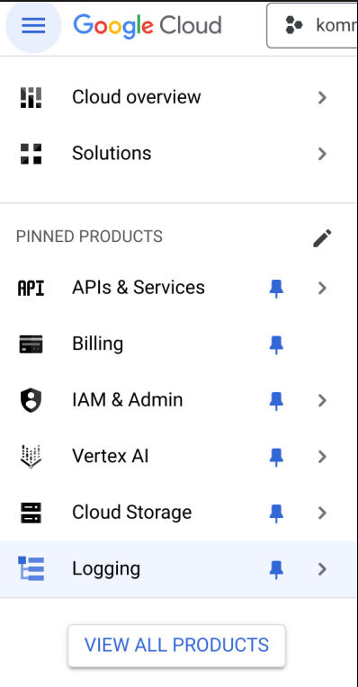
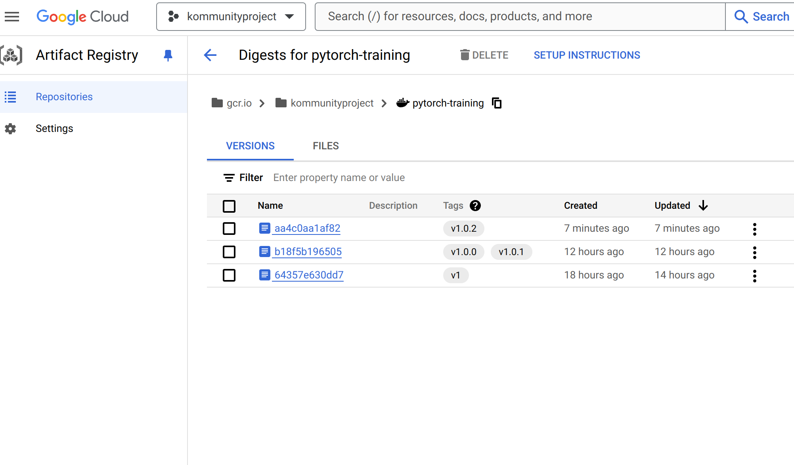
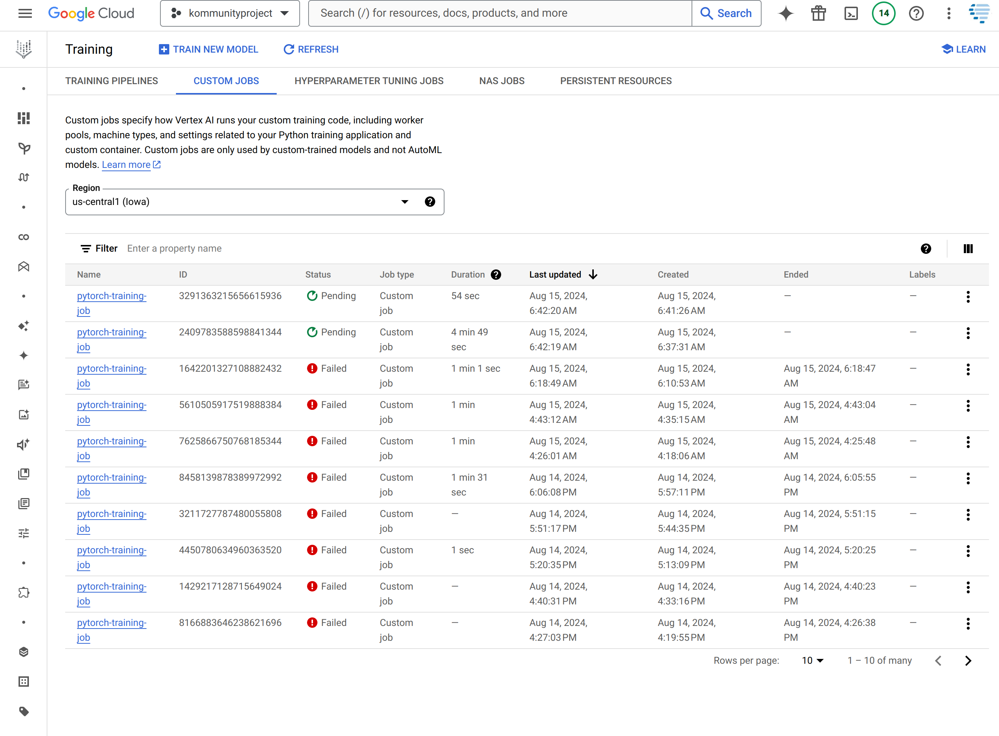
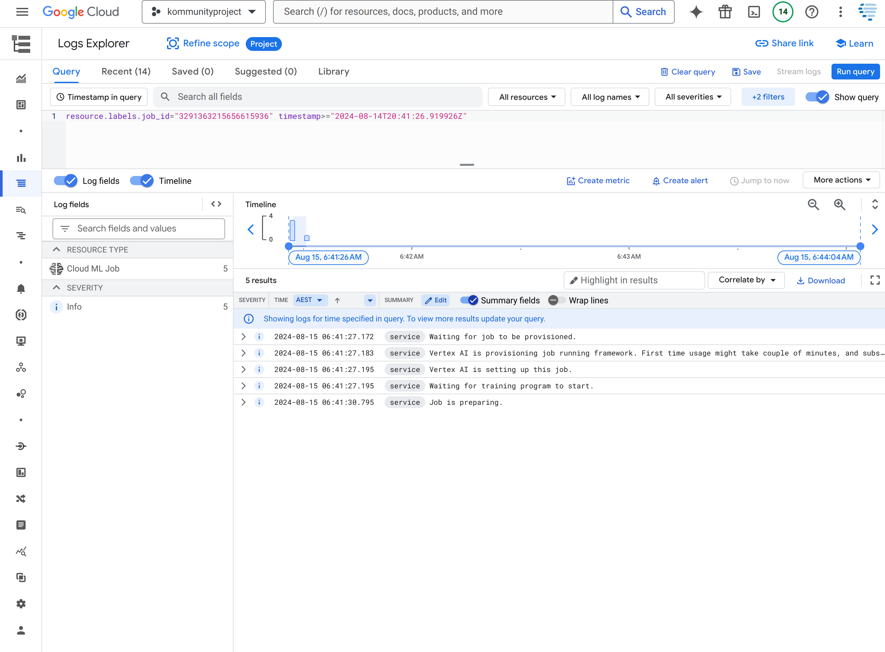
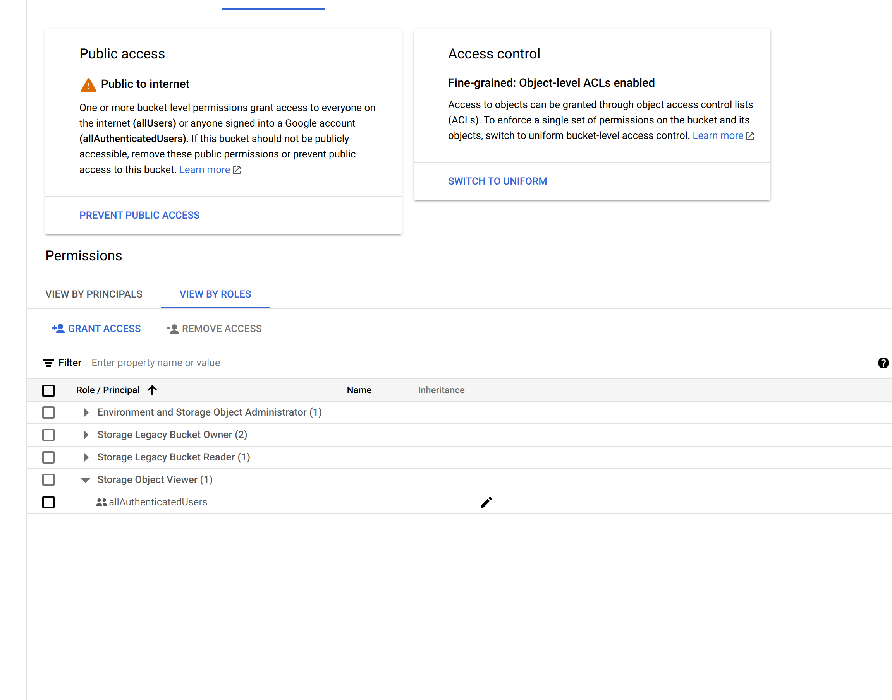

# Quick GPU Training on Google Cloud
> Spin up GPU instances for temporary PyTorch training jobs on Google Cloud Platform

This guide helps you quickly set up and run GPU-accelerated PyTorch training jobs on Google Cloud. Perfect for running experiments that need a few hours of GPU time without maintaining permanent (ec2) infrastructure.

## 🎥 Demo: Submitting a GPU Training Job
[](https://asciinema.org/a/w3E9xmUUQ9BnT9y8synw7uAz6)


## 🚀 Quick Start

1. **Set Environment Variables**
   ```bash
   export GCP_PROJECT=your-project-id
   export GOOGLE_CLOUD_BUCKET_NAME=your-bucket-name
   ```

2. **Submit Training Job**
   ```bash
   ./push-job.sh
   ```

3. **Monitor Progress**
   ```bash
   # Your job URL will appear after submission
   🔗 View job at: https://console.cloud.google.com/vertex-ai/training/custom-jobs?project=$GCP_PROJECT
   ```

<details>
<summary>🔧 Prerequisites</summary>

- Google Cloud Platform (GCP) account
- Google Cloud SDK installed
- Docker installed locally
- Weights & Biases account (optional)

[See setup instructions](#detailed-setup)
</details>

<details>
<summary>⚙️ Configuration</summary>

The `job_config_gpu.yaml` file controls your GPU and environment settings:

```yaml
workerPoolSpecs:
  machineSpec:
    machineType: a2-highgpu-1g  # 40GB GPU
    acceleratorType: NVIDIA_TESLA_A100
    acceleratorCount: 1
  replicaCount: 1
  containerSpec:
    imageUri: 'us-docker.pkg.dev/deeplearning-platform-release/gcr.io/pytorch-cu121.2-2.py310'
    env:
      - name: GCS_BUCKET_NAME
        value: gs://your-bucket
      - name: BRANCH_NAME
        value: your-branch
      - name: GITHUB_REPO
        value: your-repo
```
</details>

<details>
<summary>📦 Storage Setup</summary>

1. Create a GCS bucket:
   ```bash
   ./create_bucket.sh
   ```

2. Upload training data:
   ```bash
   gsutil -m cp -r ./training_data gs://your-bucket/
   ```


# Ubuntu/Debian
   map google cloud storage to local drive
   ```bash
   export GCSFUSE_REPO=gcsfuse-`lsb_release -c -s`
   echo "deb https://packages.cloud.google.com/apt $GCSFUSE_REPO main" | sudo tee /etc/apt/sources.list.d/gcsfuse.list
   curl https://packages.cloud.google.com/apt/doc/apt-key.gpg | sudo apt-key add -
   sudo apt-get update
   sudo apt-get install gcsfuse

   # Create mount point
   mkdir ~/cloud-storage

   # Mount bucket (replace with your bucket name)
   gcsfuse $GOOGLE_CLOUD_BUCKET_NAME ~/cloud-storage
   ```
</details>

<details>
<summary>🔑 Required Permissions</summary>

Minimum IAM roles needed:
- AI Platform Admin (`roles/ml.admin`)
- Storage Object Admin (`roles/storage.objectAdmin`)
- Container Registry Service Agent
</details>

<details>
<summary>🐛 Troubleshooting</summary>

1. **Job Won't Start**
   - Check IAM permissions
   - Verify GPU quota in your region
   
2. **Storage Access Issues**
   - Test bucket access: `gsutil ls gs://your-bucket`
   - Verify service account permissions

3. **Local Testing**
   ```bash
   # Mount cloud storage locally
   gcsfuse --anonymous-access your-bucket /mount/point
   ```
</details>

<details id="detailed-setup">
<summary>📚 Detailed Setup Guide</summary>

### 1. Enable Required APIs


> **PRO TIP** - Toggle on just these services to help you find things

### 2. Shell Configuration
```bash
# Install oh-my-zsh for better CLI experience
sh -c "$(curl -fsSL https://raw.githubusercontent.com/ohmyzsh/ohmyzsh/master/tools/install.sh)"

# Add to .zshrc
plugins=(git)
export GCP_PROJECT=your-project-id
export GOOGLE_CLOUD_BUCKET_NAME=your-bucket-name
```

### 3. Build Process
Your builds will appear in the artifacts with version bumped:


### 4. Job Management
Monitor your training jobs in the console:


### 5. Job Logs
View detailed logs and metrics:


### 6. Storage Access
For public buckets, consider granting access to allUsers:


### 7. Resource Configuration
Available machine types:
```yaml
workerPoolSpecs:
  machineSpec:
    # Choose one:
    machineType: n1-standard-8
    # machineType: n1-standard-32
    # machineType: a2-ultragpu-1g # For A100 80GB
    
    # GPU options:
    # acceleratorType: NVIDIA_TESLA_V100
    # acceleratorType: NVIDIA_A100_80GB
    # acceleratorCount: 1
```

### 8. Docker Configuration
For local testing, set these environment variables:
```shell
export GCP_PROJECT=kommunityproject
export IMAGE_NAME="pytorch-training"
export GCS_BUCKET_NAME="gs://jp-ai-experiments"
export BRANCH_NAME="feat/ada-fixed4"
export GITHUB_REPO="https://github.com/johndpope/imf.git"
```

### 9. File Structure
- `Dockerfile`: Defines training environment
- `build.sh`: Builds and pushes Docker image
- `job_config.yaml`: Training job configuration
- `push-job.sh`: Submits training job
</details>

## 📈 Monitoring

Track your training job:
- Real-time logs
- GPU utilization
- Training metrics

## 🛟 Need Help?

- [Google Cloud AI Platform Documentation](https://cloud.google.com/ai-platform/docs)
- [PyTorch Documentation](https://pytorch.org/docs/stable/index.html)
- Submit an issue for specific questions

